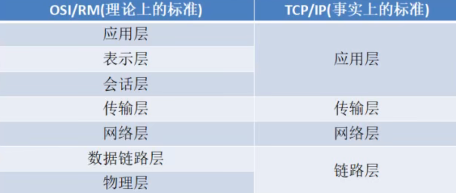

计算机网络编程

## 一、分层结构



### 1.1**IP协议(网际协议)   网络层**

**定义：**

特指为一个相互连接的网络系统从源地址到目标地址传输数据包所提供必要功能的协议。

**特点：**

无连接：ip协议不维护后续数据包的状态信息，每个数据包都是独立的，IP数据包可以不按顺序接收

不可靠：ip协议不能保证数据包能到达目的地，只提供尽力而为的服务。

（ip数据包含有源地址和目标地址）


### 1.2 TCP协议  传输控制协议

tcp协议是面向连接，可靠的传输协议

功能：

提供不同主机间进程的通信

**特点：**

1. 面向连接

   建立链接 — 使用链接 — 释放链接（虚电路）

2. tcp数据包含序号和确认序号

3. 对数据包进行排序和检错，错误的包可以重传

**目标：**

需要高度可靠的面向连接的服务

http ftp smtp等

1.3 UDP 用户数据包协议

功能：

```
不同主机进程间通信
```

特点 1. 传输不建立链接 2. 数据报不需要排序 3. 没有纠错和重传机制

服务对象

只需要查询应答的服务

如 ntp nfs dns

### **2.1 MAC地址**

用于标识设备，48bit

两个16进制数为一组(8bit)，分为6组，每组用  :   隔开  前三组为厂商id ，后三组为主设备id

### 2.2 ip地址 网际协议地址

ip地址是任意一台主机在网络上的唯一标识

ipv4 32bit

ipv6 128bit

ipv4一般用点分十进制数表示

[xxx.xxx.xxx.xxx](http://xxx.xxx.xxx.xxx)

由网络id和主机id两部分组成

子网id（网络id）：

ip地址中由子网掩码1覆盖的连续位

主机id：

ip地址中由子网掩码0覆盖的连续位

ip地址特点

```
1、子网ip不同的网络不能直接通信，需要路由器转发

2、主机id为0的为网段地址

3、主机id全为1的地址为网段的广播地址
```


公网ip

经过internet nic 划分的地址，可以直接访问互联网


私有ip

局域网内主机联络规划的，不可以直接访问互联网


### 2.3. 端口

#### **2.3.1端口概述**：

tcp/ip协议中，采用端口标识通信进程，用于区分一个系统中的多个进程


#### **2.3.2特点**

1. 同一个端口，在不同系统对应不同进程；
2. 同一个系统，一个端口只能由一个进程拥有；
3. 在一个进程拥有一个端口后，传输层传输到该端口的所有信息都由该进程接收，同理，此进程送出的所有信息都由传输层经过此端口传输。


### 2.4端口号

#### **用途：**

**用于标识一个运行的网络程序**


#### 特点：

+ 端口号是无符号短整型的类型；
+ 每个端口都有一个对应的端口号；
+ tcp、udp维护着各自独立的端口号；
+ 网络程序至少占用一个端口号；


**知名端口号 1~1023**

由iana互联网数组分配机构统一分配

如ftp-21  http-80

服务器强制使用需要加root权限


动态端口（应用程序通常使用的）

1024~65535


### 3.1数据发送过程


链路层封包格式

****


+ 记录了源mac和目的mac地址 
+ 确定了以太网头后面（上一层）用的什么协议  例如ip协议等等


网络层和传输层封包格式


### 3.2网络应用程序开发流程


## 二、网络编程实现

### 1.1字节序

#### 字节序概述：

多字节的存储顺序

+ 网络协议指定了字节存储顺序为大端存储

+ 同一台主机间的通讯不需要考虑字节序
+ 异构计算机之间通讯，需要把自己的字节序转换成网络字节序即大端格式

分为 **大端模式** 和 **小端模式**

大端模式：高位字节存储在低位地址

小端模式：低位字节存储在低位地址


大端存储0x123456

| data | address |
| :--: | :-----: |
| 0x12 |  0x01   |
| 0x34 |  0x02   |
| 0x56 |  0x03   |


union共用体给a赋值同时也会给b赋值，b是char类型只能存下一个字节，代表a地址低位存下数据


### 1.2字节序转换


htonl函数  host——>network  主机自己的字节序转换成网络字节序  l代表长整型，s代表短整型


### 2.3ip地址转换函数

概述：ip地址输入是以字符串类型传入，进行协议传输时是以4字节整型进行传输

人为识别的是字符串，网络中识别的是整型数据


inet_pton函数

in inet_pton(int family , const char *strptr , void *addrptr )

功能：

​	将点分式ip字符串地址转换成整型数据

参数：

​	family：协议族

​			AF_INET		ipv4网络协议

​			AF_INET6	      ipv6网络协议

​	strptr：点分式十进制字符串

​	addrptr：32位无符号整型ip地址

返回值：

​	成功返回1，失败返回其他

头文件：

#include<arpa/inet.h>


同理还有

inet_ntop函数，32位整型转换点分式十进制字符串

const char* inet_ntop(int family , const void *addrptr , char *strrptr ,size_t len)		

参数：

​	family：协议族

​	strptr：点分式十进制字符串

​	addrptr：32位无符号整数

​	len：strptr缓存区长度


16字节是加上了4个点 .   3*4+4  每个字节用了3个char表示就是3字节  ip地址4字节就是3*4=12  12+4=16

返回值：

​	成功返回字符串首地址，失败返回null


下面两个函数也可以转换ip地址，但只适用于ipv4


### 2.4网络编程接口socket


**类型**


### 2.5 UDP协议实现

UDP应用：dns域名解析、NFS网络文件系统、RTP流媒体等


**UDP网络编程流程**

服务器


