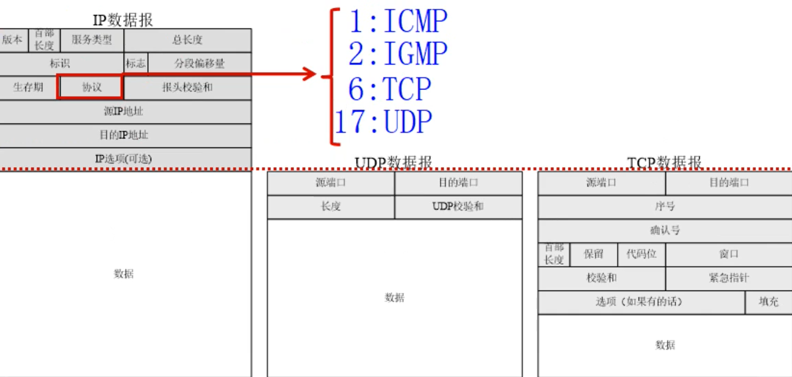

# 计算机网络编程

## 一、分层结构


### 1.1**IP协议(网际协议)   网络层**

**定义：**

特指为一个相互连接的网络系统从源地址到目标地址传输数据包所提供必要功能的协议。

**特点：**

无连接：ip协议不维护后续数据包的状态信息，每个数据包都是独立的，IP数据包可以不按顺序接收

不可靠：ip协议不能保证数据包能到达目的地，只提供尽力而为的服务。

（ip数据包含有源地址和目标地址）


### 1.2 TCP协议  传输控制协议

tcp协议是面向连接，可靠的传输协议

功能：

提供不同主机间进程的通信

**特点：**

1. 面向连接

   建立链接 — 使用链接 — 释放链接（虚电路）

2. tcp数据包含序号和确认序号

3. 对数据包进行排序和检错，错误的包可以重传

**目标：**

需要高度可靠的面向连接的服务

http ftp smtp等

1.3 UDP 用户数据包协议

功能：

```
不同主机进程间通信
```

特点 1. 传输不建立链接 2. 数据报不需要排序 3. 没有纠错和重传机制

服务对象

只需要查询应答的服务

如 ntp nfs dns

### **2.1 MAC地址**

用于标识设备，48bit

两个16进制数为一组(8bit)，分为6组，每组用  :   隔开  前三组为厂商id ，后三组为主设备id

### 2.2 ip地址 网际协议地址

ip地址是任意一台主机在网络上的唯一标识

ipv4 32bit

ipv6 128bit

ipv4一般用点分十进制数表示

[xxx.xxx.xxx.xxx](http://xxx.xxx.xxx.xxx)

由网络id和主机id两部分组成

子网id（网络id）：

ip地址中由子网掩码1覆盖的连续位

主机id：

ip地址中由子网掩码0覆盖的连续位

ip地址特点

```
1、子网ip不同的网络不能直接通信，需要路由器转发

2、主机id为0的为网段地址

3、主机id全为1的地址为网段的广播地址
```


公网ip

经过internet nic 划分的地址，可以直接访问互联网


私有ip

局域网内主机联络规划的，不可以直接访问互联网


### 2.3. 端口

#### **2.3.1端口概述**：

tcp/ip协议中，采用端口标识通信进程，用于区分一个系统中的多个进程


#### **2.3.2特点**

1. 同一个端口，在不同系统对应不同进程；
2. 同一个系统，一个端口只能由一个进程拥有；
3. 在一个进程拥有一个端口后，传输层传输到该端口的所有信息都由该进程接收，同理，此进程送出的所有信息都由传输层经过此端口传输。


### 2.4端口号

#### **用途：**

**用于标识一个运行的网络程序**


#### 特点：

+ 端口号是无符号短整型的类型；
+ 每个端口都有一个对应的端口号；
+ tcp、udp维护着各自独立的端口号；
+ 网络程序至少占用一个端口号；


**知名端口号 1~1023**

由iana互联网数组分配机构统一分配

如ftp-21  http-80

服务器强制使用需要加root权限


动态端口（应用程序通常使用的）

1024~65535


### 3.1数据发送过程


链路层封包格式

****


+ 记录了源mac和目的mac地址 
+ 确定了以太网头后面（上一层）用的什么协议  例如ip协议等等


网络层和传输层封包格式




### 3.2网络应用程序开发流程


## 二、网络编程实现

### 1.1字节序

#### 字节序概述：

多字节的存储顺序

+ 网络协议指定了字节存储顺序为大端存储

+ 同一台主机间的通讯不需要考虑字节序
+ 异构计算机之间通讯，需要把自己的字节序转换成网络字节序即大端格式

分为 **大端模式** 和 **小端模式**

大端模式：高位字节存储在低位地址

小端模式：低位字节存储在低位地址


大端存储0x123456

| data | address |
| :--: | :-----: |
| 0x12 |  0x01   |
| 0x34 |  0x02   |
| 0x56 |  0x03   |


union共用体给a赋值同时也会给b赋值，b是char类型只能存下一个字节，代表a地址低位存下数据


### 1.2字节序转换


htonl函数  host——>network  主机自己的字节序转换成网络字节序  l代表长整型，s代表短整型


### 2.3ip地址转换函数

概述：ip地址输入是以字符串类型传入，进行协议传输时是以4字节整型进行传输

人为识别的是字符串，网络中识别的是整型数据


inet_pton函数

in inet_pton(int family , const char *strptr , void *addrptr )

功能：

​	将点分式ip字符串地址转换成整型数据

参数：

​	family：协议族

​			AF_INET		ipv4网络协议

​			AF_INET6	      ipv6网络协议

​	strptr：点分式十进制字符串

​	addrptr：32位无符号整型ip地址

返回值：

​	成功返回1，失败返回其他

头文件：

#include<arpa/inet.h>


同理还有

inet_ntop函数，32位整型转换点分式十进制字符串

const char* inet_ntop(int family , const void *addrptr , char *strrptr ,size_t len)		

参数：

​	family：协议族

​	strptr：点分式十进制字符串

​	addrptr：32位无符号整数

​	len：strptr缓存区长度


16字节是加上了4个点 .   3*4+4  每个字节用了3个char表示就是3字节  ip地址4字节就是3*4=12  12+4=16

返回值：

​	成功返回字符串首地址，失败返回null


下面两个函数也可以转换ip地址，但只适用于ipv4


### 2.4网络编程接口socket


**类型**


**socket函数** 	#include <sys/socket.h>


+ 创建的socket时，系统不会分配端口
+ 创建socket套接字默认属性是主动的，即发起服务请求，而服务器是被动的，需要修改套接字属性为被动


- domain：即协议域，又称为协议族（family）。常用的协议族有，AF_INET、AF_INET6、AF_LOCAL（或称AF_UNIX，Unix域socket）、AF_ROUTE等等。协议族决定了socket的地址类型，在通信中必须采用对应的地址，如AF_INET决定了要用ipv4地址（32位的）与端口号（16位的）的组合、AF_UNIX决定了要用一个绝对路径名作为地址。
- type：指定socket类型。常用的socket类型有，SOCK_STREAM、SOCK_DGRAM、SOCK_RAW、SOCK_PACKET、SOCK_SEQPACKET等等（socket的类型有哪些？）。
- protocol：故名思意，就是指定协议。常用的协议有，IPPROTO_TCP、IPPTOTO_UDP、IPPROTO_SCTP、IPPROTO_TIPC等，它们分别对应TCP传输协议、UDP传输协议、STCP传输协议、TIPC传输协议。

**注意：并不是上面的type和protocol可以随意组合的，如SOCK_STREAM不可以跟IPPROTO_UDP组合。当protocol为0时，会自动选择type类型对应的默认协议。**


两种结构体使用场景：


##### sendto函数


##### recvfrom函数


##### recvfrom参数问题：为什么fromlen要用指针？

写服务器端函数时懂了，recvfrom函数会将接收的消息的ip等信息给sockaddr结构体，而不是像sendto需要sockaddr的信息去给接收方。因此要获得发送方的信息，利用指针将参数赋值，获得结构体长度返回。

### 2.5 UDP协议实现

UDP应用：dns域名解析、NFS网络文件系统、RTP流媒体等


#### 2.5.1**UDP网络编程流程** c/s架构

服务器：

1. 创建套接字socket
2. 将服务器ip地址、端口号与套接字绑定
3. 接收数据，recvfrom()
4. 发送数据，sendto()

客户端：

1. 创建套接字
2. 发送数据sendto()
3. 接收数据recvfrom()
4. 关闭套接字close()


**关于为什么客户端不需要绑定ip端口号而服务器需要绑定**

1. 计算机端口号数量有限，如果不进行绑定，操作系统会随机生成一个端口号给服务器。如果操作系统给服务器分配这个端口号的同时，有其他程序也准备使用这个端口号或者说端口号已经被使用，则可能会导致服务器一直启动不起来。
2. 其次，服务器运行起来就不会在停止了，我们将服务器端的端口号绑定有助于有规划的对主机中的端口号进行使用。
3. 服务器是被动，需要客户端主动寻找ip，端口号，没有绑定就找不到，而主动方的客户端在发起通讯后服务器就可以知道客户端的ip地址，同时可以动态分配端口号给客户端。
4. 因为客户端并不是一直运行的，只需要每次系统随机分配即可。


#### 2.5.2UDP代码

##### 问题1：头文件找不到

windows下winsock.h/winsock2.h 
linux下sys/socket.h

不同平台头文件不一样

#include <winsock.h> 或者 #include <winsock2.h>

<arpa/inet.h>用<windows.h>代替

##### 问题2：windows下使用socket出现未定义（clion）

```
#pragma comment(lib, "ws2_32.lib")		//手动链接库

cmakefile中加上
link_libraries(ws2_32)
```


##### 问题3：Windows下socket返回-1

[socket编程：WSAStartup函数详解-CSDN博客](https://blog.csdn.net/u014779536/article/details/115822907)

需要用WSAStartup先启动windows下的套接字

WSAStartup

- W：windows
- S：socket
- A：Asynchronous 异步
  - 同步：阻塞、卡死状态
  - 异步：多个工作同时进行
- Startup：启动

```
WORD wVersionRequested;
WSADATA wsaData;
int err;
wVersionRequested = MAKEWORD(2, 2);
err = WSAStartup(wVersionRequested, &wsaData);
if (err != 0) {
    printf("WSAStartup failed with error: %d\n", err);
    system("pause");
    exit(1);
}
```


##### 问题4：recvfrom 错误 GetLastError() SOCKET_ERROR 10014

最后一个参数fromlen的长度错误，应该给他一个初始化值，大小为[struct](https://so.csdn.net/so/search?q=struct&spm=1001.2101.3001.7020) sockaddr 的大小

既是：

int fromlen=sizeof(struct sockaddr );


##### 结果展示

完成

clent端:


server端


##### 2.5.3基于udp的tftp小文件传输

**tptp：最初用于无盘引导，（uboot使用tftp写入系统镜像ddr中）小文件传输**


**特点：**

+ 基于UDP传输协议实现(应用层)
+ 不进行用户有效性认证 


**数据传输模式：**

+ octet二进制传输
+ netascii文本传输
+ mail不再支持

tftp通信过程


tftp服务器固定端口69

+ 当客户端访问服务器时，服务器申请一个临时端口与客户端通信，当第二个客户端访问时，同样申请一个临时端口与其单独通信，实现并发通信。

+ 每个数据报都有一个编号，客户端收到后应答编号，进行信息校对（从1开始）
+ 超时未收到ack包则重发数据包

+ 当数据小于512则说明是最后一次发送，断开连接

协议分析


+ 读写请求：上传(02)还是下载(01)   	两个字节   一般到模式（数据传输模式）后0就结束了，一般不用选项  0指的是ascii0就是 "\0"

  例子：01text.txt0octet0   01下载 文件名text.txt的文件 采用octet二进制传输

+ 数据包：操作码03  块编号从1开始

+ 应答包：操作码04

+ 错误应答：操作码05

  

+ oack几乎不用

open:

```
fd=open(filename,O_WRONLY|O_CREAT|O_TRUNC,0664);
```

Linux系统中采用三位八进制的数字来表示文件的操作权限，为了表示方便（不确定是不是这个原因）通常用四位八进制数来表示，首位取0，也即0ABC的形式，其中A、B、C都是0~7的数字：
A表示的是文件主的权限；
B表示的是组用户的权限；
C表示的是其他用户的权限。

0~7各个数字代表的含义如下（r：Read读，w：Write写，x：eXecute执行）：

---     0   不可读写，不可执行
--x     1   可执行，不可读写
-w-     2   可写，不可读，不可执行
-wx     3   可写可执行，不可读
r--     4   可读，不可写，不可执行
r-x     5   可读，可执行，不可写
rw-     6   可读写，不可执行
rwx     7   可读写，可执行
1
2
3
4
5
6
7
8
因此，
0644代表的是文件主有可读写的权限，组用户和其他用户有可读的权限。

##### 问题1：tftp客户端程序卡在recvfrom处

发送的数据太长了，导致服务器没响应

发送长度刚好和命令长度一样就行


而不是sizeof(send_cmd);


##### 问题2：写文件出错

发现是大意写成if ( fd = open(xxx) ==-1)    由于==优先级更高fd=判断后的bool值 0  导致后面write传入的fd错误

应该加括号  if ((fd=open(xxx))==-1 )


##### 问题3：只能写一次，块编号不增加

只能写512个字节，调试发现块编号等于1后不增加，重复发第一个数据包

判断为没接收到客户端的ack包

经过排查sendto（ack）发现问题  第一次发送服务器端口是69  后面会服务器会创建临时端口，所以是端口未更新

用servrveraddr结构体去recvfrom接收数据或者创建一个新结构体接收服务器发送信息的新端口信息，更改sendto的ip相关结构体即可

